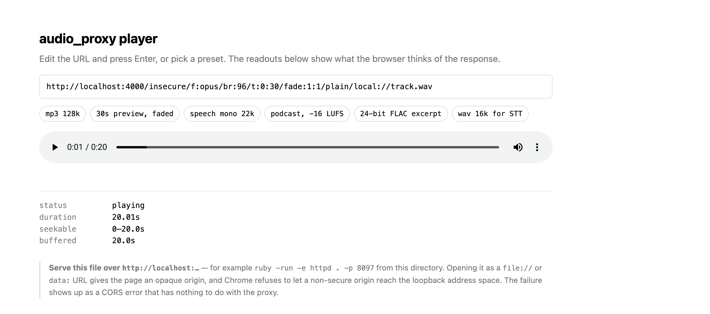

# Examples

Small, dependency-free things to try the proxy with. Nothing here is part of the release image.

## `player.html`

A one-file browser player. Pick a preset or edit the URL, and watch what the browser makes of the response.



It exists because the difference between a render in progress and a cached variant is hard to see from `curl` and obvious in a player: a variant still encoding reports `Infinity` for duration and refuses to seek, while a cached one reports a real duration and scrubs. Presets cover the formats and option combinations from the README.

### Running it

The proxy needs to be up with a file called `track.wav` under `AP_LOCAL_ROOT` (the [Quick start](../README.md#quick-start) sets exactly that up), then:

```bash
cd examples
ruby -run -e httpd . -p 8097 --bind-address 127.0.0.1
# open http://127.0.0.1:8097/player.html
```

Any static server will do; `python3 -m http.server 8097` is the same thing.

### It has to be served, not opened

Opening the file directly (`file://`, or pasting a `data:` URL) gives the page an **opaque origin**, and Chrome will not let a non-secure origin make requests into the `loopback` address space. The failure is reported as a CORS error naming a "more-private address space", which reads as though the proxy is misconfigured. It is not: serving the page from `http://localhost` makes the origin loopback itself, and it works.

The same rule is why the proxy sends no `Access-Control-Allow-Origin`. It does not need to — `<audio>` plays cross-origin media without CORS. Anything that *reads* the bytes (`fetch`, Web Audio, `<audio crossorigin>`) would need headers the proxy does not currently send.

### Reading the diagnostics

| Field | While rendering | Once fully received | On a cached variant |
|---|---|---|---|
| `duration` | `Infinity` — no `Content-Length` to derive it from | the real duration | the real duration |
| `seekable` | empty, or only what has arrived | the whole buffered range | the whole variant |
| `buffered` | grows as the encoder produces bytes | complete | grows as the file transfers |

The screenshot above is the middle column, which is why it *can* seek: `seekable` tracks what the browser holds, so once a short variant has fully arrived the scrubber works.

The limitation is narrower than "you cannot seek", and worth stating precisely: **without `Accept-Ranges` the browser cannot jump to a position it has not received.** It has to fetch everything up to that point first. On a twenty-second preview that is invisible; on an hour-long file it is the difference between seeking and waiting. Range requests need a variant with a known size, which is what the cache provides.

Playback itself starts almost immediately in every column. That is the design: bytes leave as they are encoded rather than after the whole file exists.
